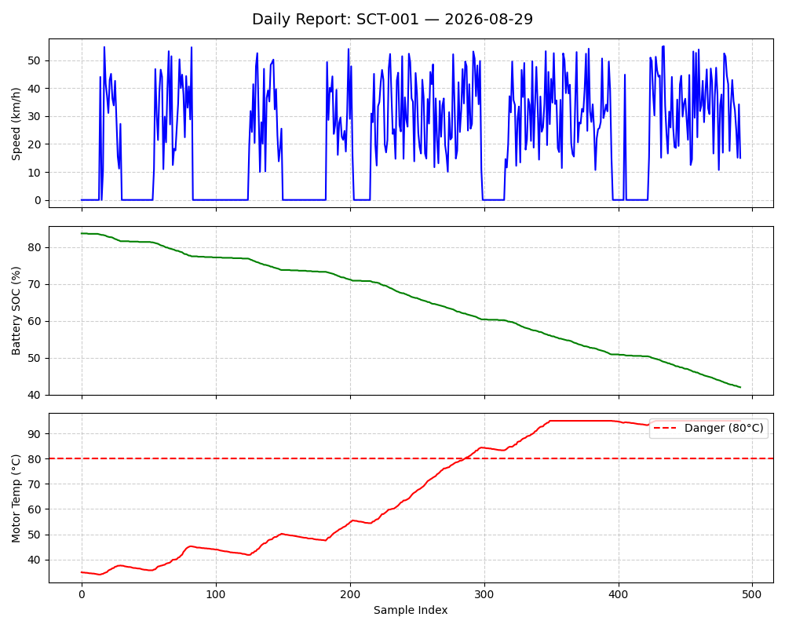

# Scooter Telemetry Analytics

A comprehensive data analytics pipeline for processing electric scooter telemetry data. This system ingests sensor readings, validates data quality, performs sessionization, computes operational metrics, detects anomalies, and generates analytical reports for IoT fleet management.

---

## Table of Contents

1. [Overview](#overview)
2. [Technology Stack](#technology-stack)
3. [Installation](#installation)
4. [Project Structure](#project-structure)
5. [Data Model](#data-model)
6. [Pipeline Components](#pipeline-components)
7. [Usage](#usage)
8. [Testing](#testing)
9. [Output Examples](#output-examples)

---

## Overview

### Features

- **Data Ingestion**: Load and validate CSV telemetry data
- **Sessionization**: Group temporal data into operational periods (riding, charging, idle)
- **Metrics Computation**: Calculate daily KPIs (distance, ride time, battery consumption, temperature)
- **Anomaly Detection**: Rule-based detection for temperature spikes, SOC glitches, GPS jumps
- **Multi-Format Reports**: JSON summaries and PNG visualizations

### Architecture

```
Raw CSV → Validation → Sessionization → Metrics → Anomaly Detection → Reports (JSON/PNG)
```

Modular design with type-safe dataclasses, per-vehicle processing, and fail-safe validation.

---

## Technology Stack

| Component | Specification |
|-----------|---------------|
| **Operating System** | Windows 11 |
| **IDE** | Visual Studio Code |
| **Python Version** | 3.12.3 |
| **Package Manager** | pip |

### Dependencies

- **NumPy**: Numerical computations
- **Matplotlib**: Data visualization
- **pytest**: Unit testing

---

## Installation

### Prerequisites

- Python 3.8+ (tested on 3.12.3)
- pip package manager

### Setup

```bash
# Clone repository
git clone https://github.com/srijaaa22/Scooter_Telemetry_Analytics.git
cd Scooter_Telemetry_Analytics

# Create virtual environment (recommended)
python -m venv venv
venv\Scripts\activate  # Windows
# source venv/bin/activate  # Linux/macOS

# Install dependencies
pip install -r requirements.txt

# Generate sample data
python generate_data.py

# Verify installation
pytest tests/
```

---

## Project Structure

```
Scooter_Telemetry_Analytics/
├── data/
│   └── sample_telemetry.csv      # 1,500 synthetic samples
├── telemetry/                     # Core processing modules
│   ├── models.py                 # Data models (5 dataclasses)
│   ├── ingest.py                 # CSV loading & validation
│   ├── sessionize.py             # Session grouping
│   ├── metrics.py                # Metrics computation
│   ├── anomaly.py                # Anomaly detection
│   └── reports.py                # Report generation
├── tests/
│   └── test_basics.py            # 7 unit tests
├── reports/                       # Output directory
│   ├── SCT-001_summary.json
│   ├── SCT-001_report.png
│   └── ...
├── generate_data.py               # Data generator
├── main.py                        # Pipeline orchestrator
└── requirements.txt
```

---

## Data Model

### Core Data Structures

**TelemetrySample**: Single sensor reading
```python
timestamp: str          # ISO 8601 format
vehicle_id: str         # e.g., "SCT-001"
speed_kmph: float       # 0-150 km/h
soc: float              # Battery % (0-100)
motor_temp_c: float     # Motor temperature (°C)
lat, lon: float         # GPS coordinates
state: str              # "idle", "riding", "charging"
```

**Session**: Continuous operational period
```python
session_type: str       # "riding", "charging", "idle"
start_time, end_time: str
sample_count: int
start_soc, end_soc: float
max_speed, max_temp: float
```

**DailyMetrics**: Aggregated daily KPIs
```python
total_ride_time_min, distance_estimate_km, avg_speed_kmph: float
soc_drop_pct, max_temp_c: float
num_rides, num_charges: int
```

**Anomaly**: Detected irregularity
```python
timestamp, rule, severity, explanation: str
```

---

## Pipeline Components

### 1. Ingestion & Validation

**Module**: `telemetry/ingest.py`

Validates:
- Required fields presence
- ISO 8601 timestamp format
- Numeric parsing (speed, SOC, temperature, GPS)
- Range checks (speed: 0-150, SOC: 0-100)
- State validation (idle/riding/charging)

Returns: `(valid_samples, error_list)`

### 2. Sessionization

**Module**: `telemetry/sessionize.py` - Groups consecutive samples with same state into sessions.

### 3. Metrics Computation

**Module**: `telemetry/metrics.py` - Calculates distance (Σ speed×Δt), ride time, avg speed, SOC drop, max temp.

### 4. Anomaly Detection

**Module**: `telemetry/anomaly.py`

**Rule-Based Detection**:

| Rule | Condition | Severity | Description |
|------|-----------|----------|-------------|
| SOC Glitch | SOC increases while riding | Medium | Battery can't charge during use |
| Temperature Spike | motor_temp > 80°C | High | Overheating risk |
| GPS Jump | Δlat/lon > 0.01° | Medium | Impossible location change |

### 5. Report Generation

**Module**: `telemetry/reports.py` - Generates JSON (metrics + anomalies) and PNG (3-panel chart).

---

## Usage

### Basic Execution

```bash
python main.py
```

Default: processes all CSV files in `data/`, outputs to `reports/`

### Custom Directories

```bash
python main.py --input raw_data/ --out output_reports/
```

### Command-Line Arguments

| Argument | Default | Description |
|----------|---------|-------------|
| `--input` | `data/` | Input CSV directory |
| `--out` | `reports/` | Output directory |

### Console Output

```
Loading data/sample_telemetry.csv...
  Loaded 1485 valid rows, found 15 errors.
Processing 3 vehicles...
SCT-001: 9 rides, 0 charges, 208 anomalies → reports/SCT-001_report.png
Done! Reports saved to reports/
```

---

## Testing

### Running Tests

```bash
pytest tests/              # All tests
pytest tests/ -v           # Verbose output
```

### Test Coverage (7 tests)

Ingestion, sessionization, and anomaly detection tests covering validation, grouping, and all detection rules.

---

## Output Examples

### JSON Report

```json
{
  "vehicle_id": "SCT-001",
  "date": "2026-08-29",
  "metrics": {
    "total_ride_time_min": 974.17,
    "distance_estimate_km": 530.86,
    "avg_speed_kmph": 32.71,
    "num_rides": 9,
    "num_charges": 0
  },
  "anomaly_count": 208,
  "anomalies": [...]
}
```

### PNG Visualization



*Figure: Sample report showing speed profile, battery discharge, and temperature (with 80°C threshold). Vehicle SCT-001: 9 rides, 974 minutes, 530.86 km, 208 anomalies.*

### Sample Dataset & Results

1,500 samples from 3 vehicles (SCT-001, SCT-002, SCT-003) over 24 hours. 99% validation pass rate.

**Vehicle SCT-001 Summary:**

| KPI | Value |
|-----|-------|
| Ride Time | 974 min (~16h) |
| Distance | 530.86 km |
| Avg Speed | 32.71 km/h |
| Battery Drain | 41.7% |
| Max Temp | 95.0°C |
| Rides | 9 |
| Anomalies | 208 (mostly temp spikes) |

---

## Future Enhancements

Real-time processing (Kafka), ML for predictive maintenance, database integration, web dashboard, advanced anomaly detection, multi-day analysis, RESTful API, geospatial analysis.

---

## Contributing

Fork the repository, create a feature branch, write tests, ensure tests pass, and submit a pull request.

**Code Style**: Follow PEP 8, use type hints, add docstrings, maintain 80%+ test coverage

---

## License

MIT License - See LICENSE file for details.

---

## Citation

```bibtex
@software{scooter_telemetry_analytics,
  author = {Srija},
  title = {Scooter Telemetry Analytics: An ETL Pipeline for IoT Fleet Management},
  year = {2026},
  url = {https://github.com/srijaaa22/Scooter_Telemetry_Analytics}
}
```

---

## Contact

Issues/questions: https://github.com/srijaaa22/Scooter_Telemetry_Analytics/issues

**Version**: 1.0.0 | **Python**: 3.12.3 | **Status**: Production Ready
